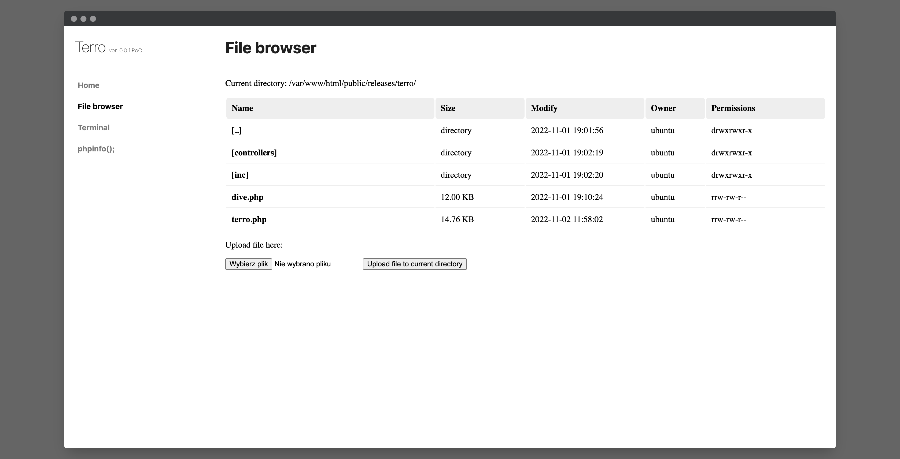
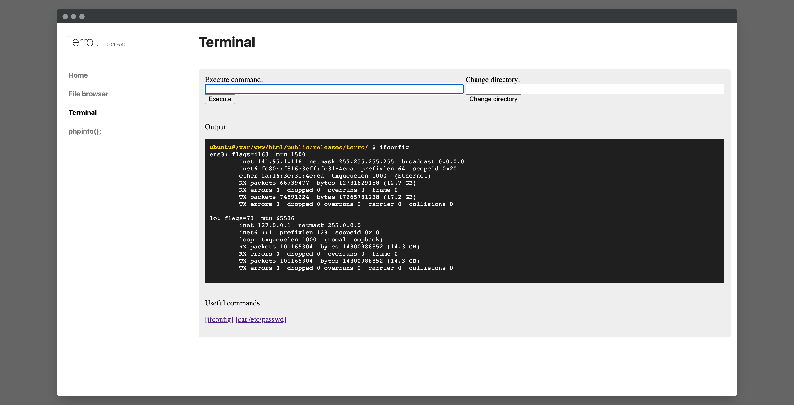
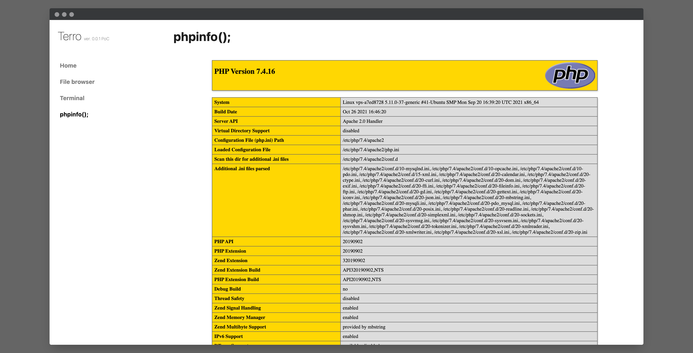

# Terro PHP WebShell

### 📋 Legal disclaimer

Usage of Terro PHP WebShell for attacking targets without prior mutual consent is illegal. It is the end user's responsibility to obey all applicable local, state and federal laws. Developers assume no liability and are not responsible for any misuse or damage caused by this program

### 🚀 Functions

* Execute commands on linux server
* Browse files and directories
* Read files
* Upload files  
* phpinfo output
* check active services

### Screenshots

### 🔥 Plans and ideas (next versions)

* remove/copy/move files
* better UI for active services
* more useful commands in terminal
* find file by extension
* MySQL dump creator
* PostgreSQL dump creator
* download file
